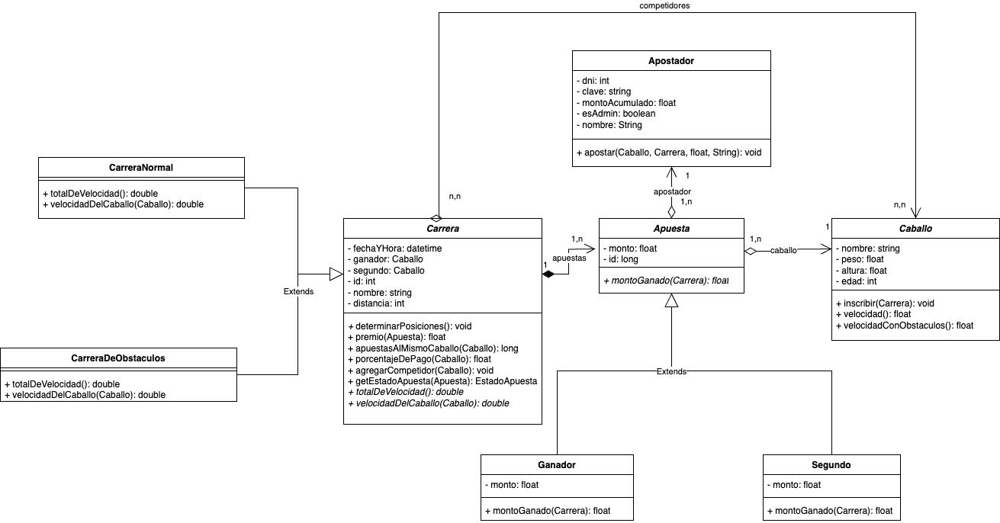

# Trabajo Practico Integrador Tecnicas Avanzadas de Programacion - Carreras de Caballos

El presente trabajo practico realizado para la materia Tecnicas 
Avanzadas de Programacion de la Universidad de Palermo, consiste
en el desarrollo de una API que simula un sistema de apuestas
de carreras de caballos, que debe cumplir los siguientes 
requerimientos:

- El usuario debe poder visualizar el listado de carreras próximas, asì como los caballos a los cuales puede apostar, considerando cuanto paga como premio en caso de ganar.

- Se debe controlar que el usuario no haga una apuesta una vez iniciada la carrera.
- Se debe poder de forma aleatoria o bien desde un administrador, cargar el caballo ganador de la carrera.
- A partir de la determinación del ganador el sistema debe realizar (setear) el pago de la apuesta, a el o los apostadores ganadores.
- El usuario debe realizar la apuesta a partir de un acceso privado (debe validarse su identidad)

## Documentacion
Se disponibiliza la [documentacion de la API](https://documenter.getpostman.com/view/31014906/2sAXxS7qt5) 
realizada a partir de la tambien disponibilizada [coleccion de postman](documentacion/Trabajo%20Practico%20-Tecnicas%20Avanzadas%20de%20Programacion%20-%20Carreras%20de%20Caballos.postman_collection.json)
. A continuacion se deja una imagen del diagrama de clases del modelo, ademas
que se deja el informe del [trabajo practico en formato PDF](documentacion/Trabajo%20Practico%29Integrador%20Primera%20Entrega%20Lucas%20Martinez.pdf), correspondiente
a la primera etapa del mismo.

## Instalacion
Para instalar el proyecto, primero se debera clonar el repositorio,
para esto se debera disponer de [git](https://git-scm.com/downloads) instalado,
y ejecutar el comando `git clone https://github.com/lucasljm2001/tecnicas-avanzadas-de-programacion.git`,
o en su defecto utilizar la herramienta de git de su preferencia.
Una vez que se cuente con el repositorio clonado, hay dos posibles alternativas para poder ejecutar el proyecto,
una requiere docker instalado y otra no, a continuacion se detallan ambas:

### Instalacion sin Docker
Para instalar el proyecto sin usar docker, se debera tener instalado [mysql](https://www.mysql.com/downloads/),
la [jdk 17](https://www.oracle.com/java/technologies/javase/jdk17-archive-downloads.html) y [maven 3.8.4](https://maven.apache.org/docs/3.8.4/release-notes.html),
luego se deberan crear las variables de entorno DB_URL, DB_USER y DB_PASSWORD con el usuario, url y contraseña de la base de datos respectivamente.
Una vez hecho esto, se debera ejecutar el comando `mvn clean install` en la raiz del proyecto, y luego ejecutar el comando `mvn spring-boot:run` para finalmente
ejecutar el proyecto. Como alternativa a la ejecucion de estos ultimos comandos,
es posible instalar un IDE como [IntelliJ](https://www.jetbrains.com/idea/download/) para ejecutar el proyecto

### Instalacion con Docker
Para ejecutar el proyecto mediante esta alternativa, se debe contar con [Docker](https://docs.docker.com/compose/install/) instalado,
luego debe utilizarse el archivo [.env.example](.env.example) para crear un archivo .env con las variables de entorno necesarias (un detalle importante, es que 
la url debe ser como la propuesta en el ejemplo, ya que si se le pone localhost, docker no la podra leer, y el puerto debe ser el 3307, ya que la base mysql esta siendo mapeada a ese puerto), y
finalmente para ejecutar el proyecto, se deben correr los comandos `docker build -t tecnicas-de-programacion .` y `docker-compose up`. Alternativamente
es posible ahorrarse estos comandos, si se utiliza algun IDE como el antes mencionado.